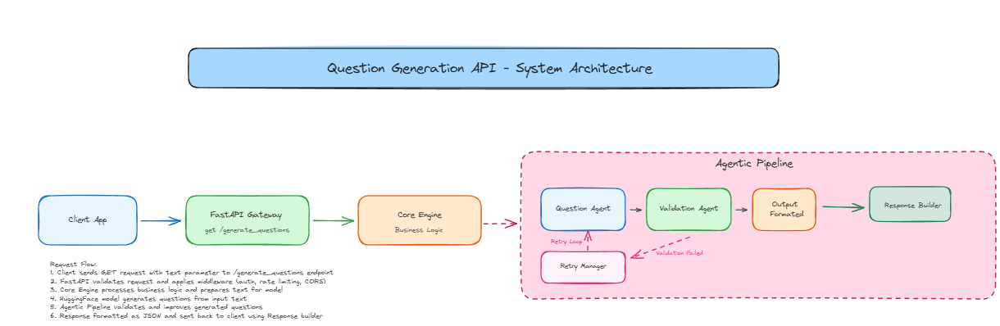

# Question Generation API

## What it does

Takes text, generates decent questions about it. Uses a multi-agent pipeline because just throwing text at a model gives you garbage questions.

## How it works

Flask API receives text, passes it to the question agent which generates questions using flan-t5-base model. Validation agent checks if questions are good quality. If they suck, retry manager tries again with different prompts. If everything fails, we use fallback questions.

## Current endpoints

- `GET /generate-question?text=...` - Returns 3 questions as JSON

## Would Build if writing production application

- Frontend (currently just raw API)
- Streaming responses
- Response caching
- Rate limiting
- Better error handling
- Question history/analytics
- Batch processing for multiple texts

## Settings

- 3 questions per request
- Max 10 retry attempts
- Temperature 0.8-1.4
- 65% similarity threshold for duplicates
